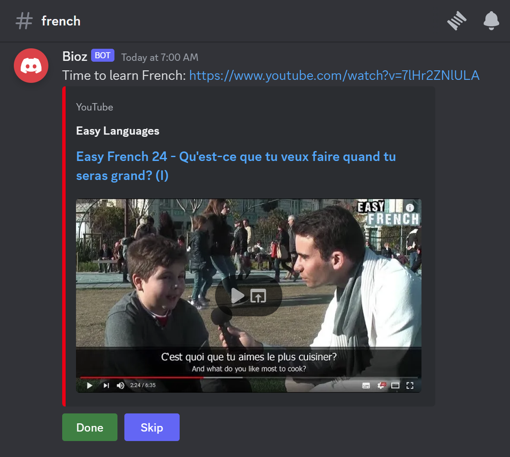
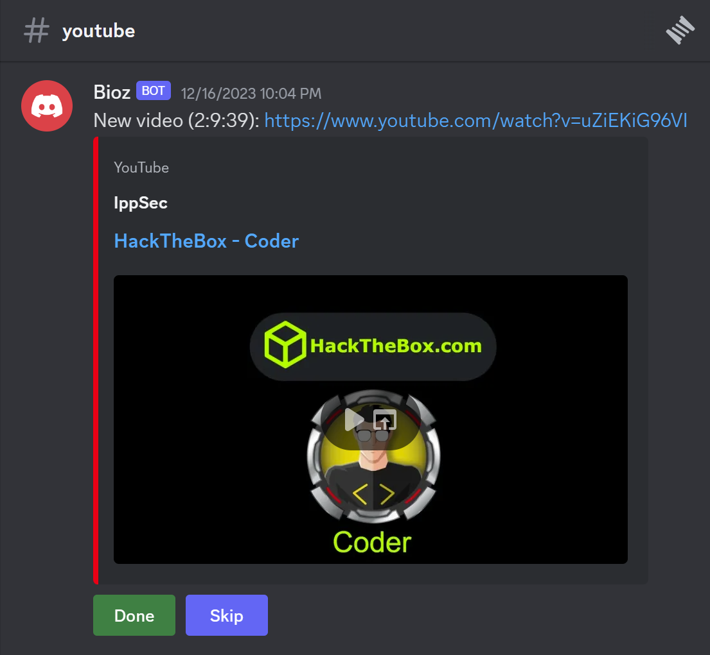
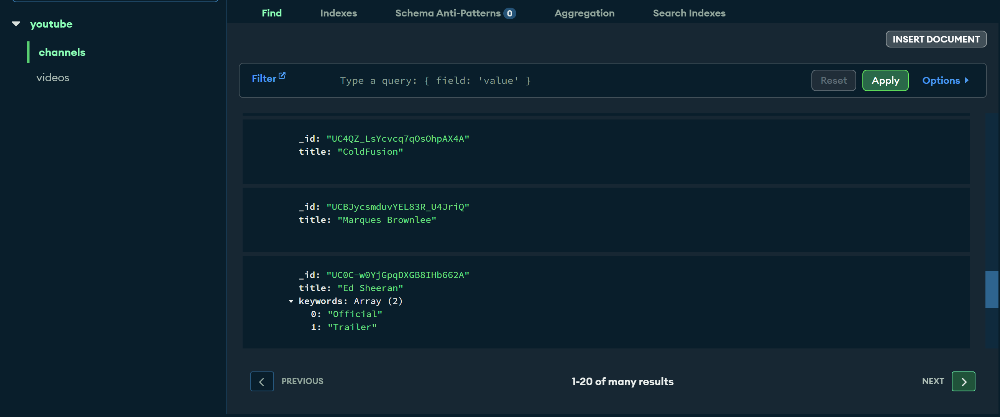
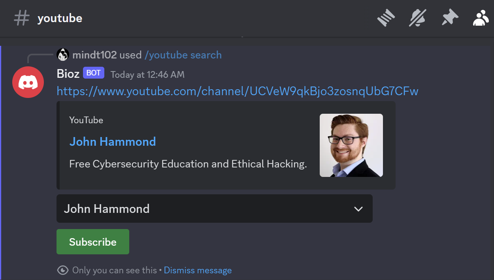
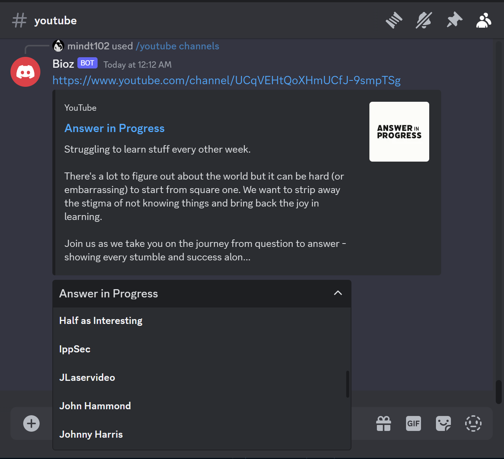
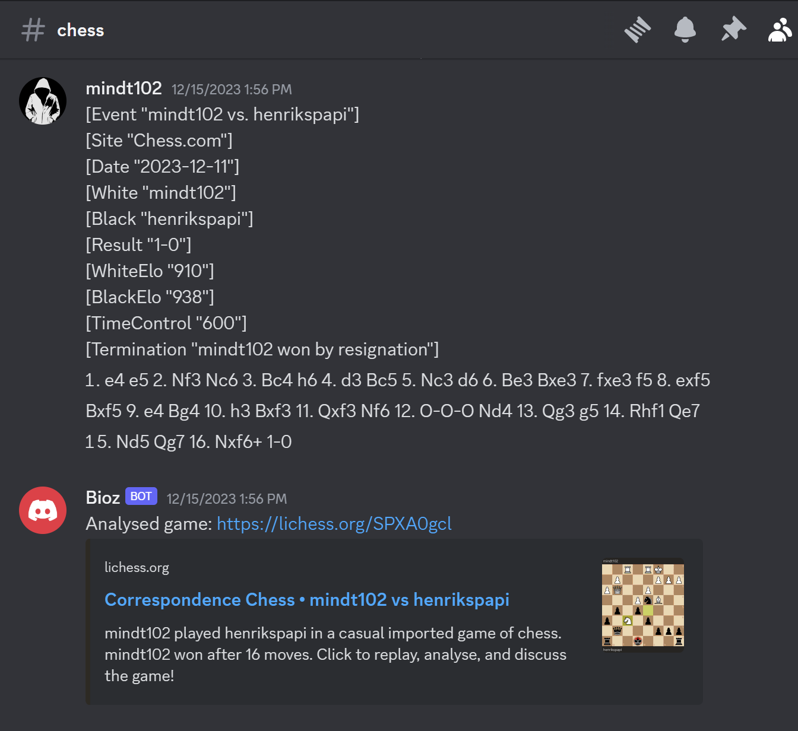

# Personalized Discord Virtual Assistant

A Discord bot for my personal use to help optimize my productivity and workflow.

## Daily French Materials Suggestions
### Motivation:
Automatically suggest a French video every day to help me maintain a consistent habit of language learning:

### How it works:
- Exchange credentials from [Auth0](https://auth0.com/) - an identity provider - with [Google's Secure Token Service](https://cloud.google.com/iam/docs/reference/sts/rest) to obtain a valid access token to Google Cloud resources
- Leverage the [Youtube API](https://developers.google.com/youtube/v3) to randomly search and select a video from [Easy French's channel](https://www.youtube.com/@EasyFrench)
- Send a message daily to a designated channel with the link to the video

## Real-time Youtube video updates
### Motivation:
Update me with messages embedded with the latest videos from my favorite channels, allowing me to watch them directly from Discord and avoiding YouTube's addictive recommendation algorithm. 
Channels can be searched by name, added, and removed from the subscription list through the Discord User Interface.

### How it works:
- MongoDB is used to store the subscription list and video history to avoid sending duplicate notifications and support future analytics

- Discord slash commands are used to manage the subscription list:
    - `/youtube search <query>`: Search for a Youtube channel by name 
    
    - `/youtube channels`: List all the channels that are currently being subscribed to
    
    - Add a YouTube channel to the subscription list
    - Remove a YouTube channel from the subscription list

- To update videos in real-time, the bot:
    - Subscribe to [Youtube's feed](https://www.youtube.com/xml/feeds/videos.xml) on [Google PubSubHubbub Hub](https://pubsubhubbub.appspot.com/) with a channel's ID to receive notifications when its latest video is uploaded
    - Start an HTTP server serving as a webhook that listens to the subscription's notifications
    - When new video notifications are received, they are parsed and filtered based on their title
    - The filtered video is then added to the video history and sent to the designated channel

## Chess Game Analysis 
### Motivation:
Automatically submit my games to [Lichess API](https://lichess.org/api) and send me a link to the analysis when I share the Portable Game Notation (PGN) of the games

### How it works:
- The bot listens to messages sent in the designated channel
- When a message contains a PGN from Chess.com, the bot:
    - Sends a POST request to Lichess API to submit the game
    - Sends a message to the channel with the link to the analysis

# How to run
## Environment Variables
- Discord credentials:
    - BOT_TOKEN: Discord bot token
- Auth0 credentials:
    - AUTH0_CLIENT_ID: Client ID from Auth0
    - AUTH0_CLIENT_SECRET: Client secret from Auth0
    - AUTH0_AUDIENCE: Audience from Auth0
    - AUTH0_DOMAIN: Domain from Auth0
- MongoDB credentials:
    - MONGODB_URI: MongoDB URI
    - MONGODB_USERNAME: MongoDB username
    - MONGODB_PASSWORD: MongoDB password
    - DB_NAME: MongoDB database name

- CALLBACK_URL: Callback URL for the bot to receive notifications from Google PubSubHubbub Hub
- DEBUG_CHANNEL: ID of a Discord channel for debugging
## Prerequisites
- [Docker](https://docs.docker.com/get-docker/)
- [Docker Compose](https://docs.docker.com/compose/install/)

## Steps
- Clone the repository
- Create a `.env` file in the root directory with the environment variables based on the `.env.example` file
    - Setup Discord credentials:
        - Create a Discord bot and obtain its token
        - Add the bot to a server
    - Setup Auth0 credentials:
        - Create an Auth0 account
        - Create a new application
        - Add the audience, client ID, client secret, and domain to the `.env` file
    - Setup MongoDB credentials:
        - Create a MongoDB account
        - Create a new cluster
        - Add the URI, username, password, and database name to the `.env` file
    - Obtain a domain name for the webhook callback URL
    - Create a Discord channel for debugging and add its ID to the `.env` file
- Run `docker-compose up -d` to start the bot